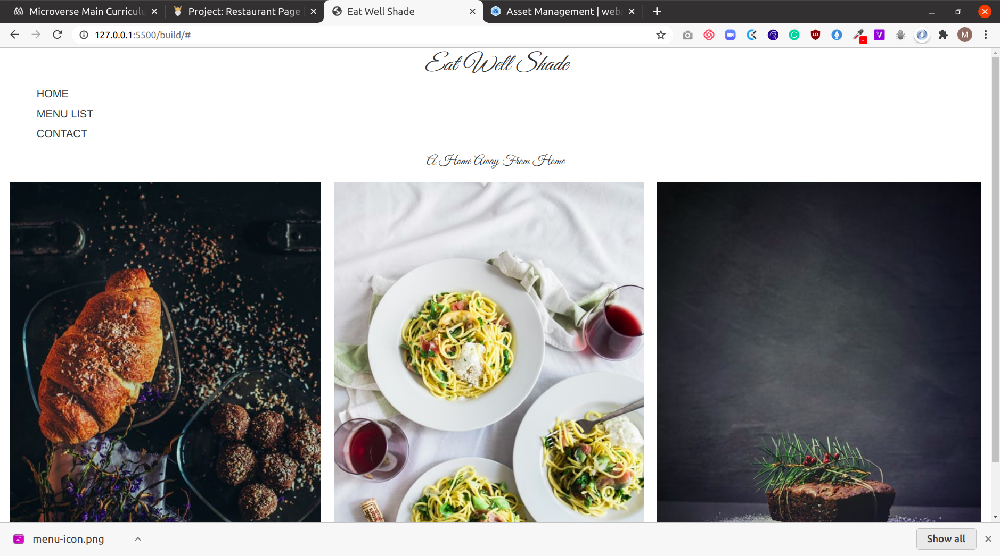

# restaurant-page


## Project description
This project is an implementation of a restaurant web page.

This project was done mainly for learning purposes, the aim was to practice using the webpacker javascript framework. The project's specifications are listed on [The odin project](https://www.theodinproject.com/courses/javascript/lessons/restaurant-page)

## Screenshot


## Built with
- HTML5
- CSS3
- Vanilla Javascript
- Webpack js framework

## Features
- Page contains a home page, contact as well as menu page.
- There's a responsive tabs menu for navigation 
- User can view web content displayed in a responsive grid layout

## Deployment
[RestaurantPage app on netlify](https://gracious-johnson-c5af22.netlify.app)

## Running and testing it locally

### Prerequisites
No special pre-requisite required for this project

### Setup
- Run `git clone https://github.com/bluette1/restaurant-page && cd restaurant-page` to get a copy of source codes on your local computer and to navigate inside the project directory

### Usage
- If you have a live-server installed on you computer, you can open `index.html` file with that server by running the following commands

```
npm install
npm run build
``` 

### Tests
- No test yet

## Contributions

There are two ways of contributing to this project:

1.  If you see something wrong or not working, please check [the issue tracker section](https://github.com/bluette1/restaurant-page/issues), if that problem you met is not in already opened issues then open a new issue by clicking on `new issue` button.

2.  If you have a solution to that, and you are willing to work on it, follow the below steps to contribute:
    1.  Fork this repository
    1.  Clone it on your local computer by running `git clone https://github.com/your-username/restaurant-page.git` __Replace *your username* with the username you use on github__
    1.  Open the cloned repository which appears as a folder on your local computer with your favorite code editor
    1.  Create a separate branch off the *master branch*,
    1.  Write your codes which fix the issue you found
    1.  Commit and push the branch you created
    1.  Raise a pull request, comparing your new created branch with our original master branch [here](https://github.com/bluette1/restaurant-page)

## Author

👤 **Marylene Sawyer**
- Github: [@Bluette1](https://github.com/Bluette1)
- Twitter: [@MaryleneSawyer](https://twitter.com/MaryleneSawyer)
- Linkedin: [Marylene Sawyer](https://www.linkedin.com/in/marylene-sawyer)


## Show your support

Give a ⭐️ if you like this project!

## Acknowledgment
- [Microverse](https://www.microvese.org)
* [Webpack](https://webpack.js.org/)
* [UnSplash Images](https://unsplash.com/)
* [Responsive Nav Bar](http://responsive-nav.com/)
